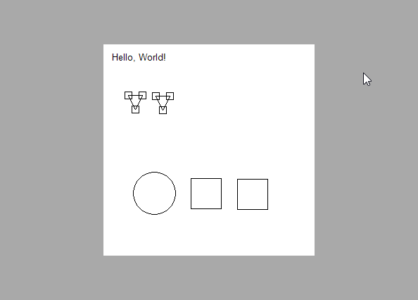

Primitive Canvas
=============================================================================

Primitive Canvas is a simple Windows Forms control to render and modify
shapes on a canvas. It allows adding, removing, moving, and rotating
them, and multiple shapes can be combined in canvas objects to be
modified together.

I developed it as part of a map editor that operates on rectangular
shapes.

Features
-----------------------------------------------------------------------------

- Managing objects made up of shapes
- Moving and rotating objects
- Zooming in and out

Example
-----------------------------------------------------------------------------

